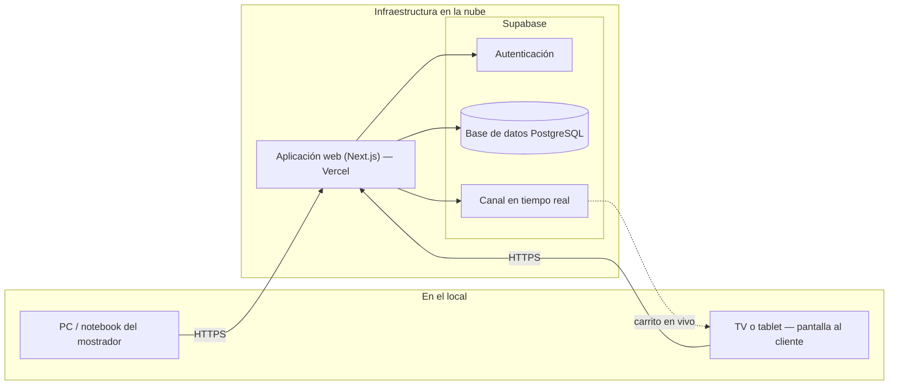
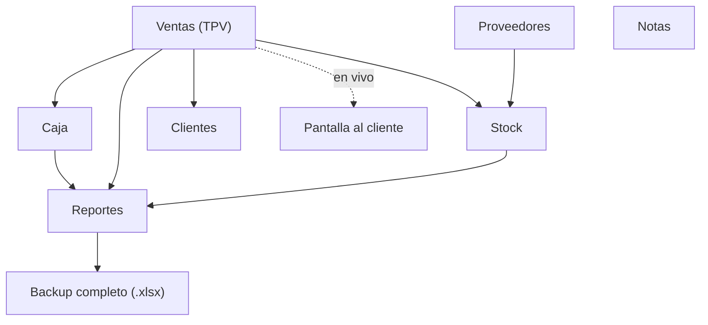
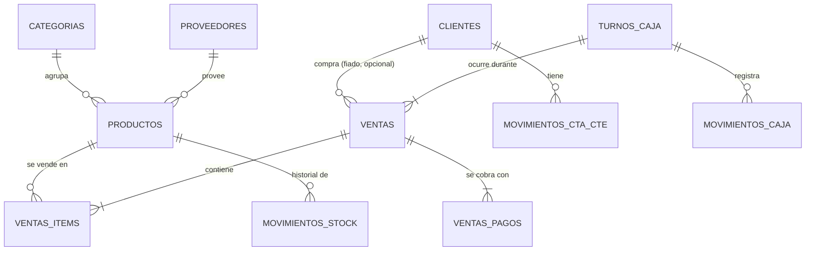

# Informe técnico — Sistema Mini Market Marlyn

## 1. Resumen

Sistema de gestión comercial a medida para un minimarket de un solo
local: punto de venta, stock, caja, clientes (cuenta corriente),
proveedores, reportes y una pantalla en vivo para el mostrador.
Construido como aplicación web, pensado para usarse desde una
notebook o PC en el local, sin necesidad de instalar nada más que un
navegador.

## 2. Stack tecnológico

| Capa | Tecnología | Rol |
|---|---|---|
| Frontend | Next.js (React) + TypeScript | Interfaz de usuario, tanto las pantallas como la lógica de cada módulo |
| Estilos | Tailwind CSS + sistema de diseño propio | Look & feel consistente, con los colores/tipografías del negocio centralizados en un único archivo |
| Backend / base de datos | Supabase (PostgreSQL) | Autenticación, base de datos, reglas de acceso y funciones de negocio |
| Tiempo real | Supabase Realtime | Usado por la pantalla al cliente (carrito en vivo) |
| Exportaciones | ExcelJS | Generación de todos los archivos `.xlsx` (reportes, stock, caja, backup) |
| Testing | Vitest + GitHub Actions (CI) | Tests automáticos en cada cambio: funciones de cálculo, y pruebas reales de seguridad contra la base |
| Hosting | Vercel | Aloja la aplicación web en un dominio público, con un despliegue nuevo automático cada vez que se actualiza el código |

No se usan frameworks de UI de terceros (como Material UI o Bootstrap)
ni librerías de gráficos: los gráficos del panel de reportes están
hechos a medida, en línea con el resto del diseño.

## 3. Arquitectura general

La aplicación es una única app web: no hay un "servidor" aparte que
mantener, ni instalación local de base de datos. Todo el dato vive en
Supabase, en la nube.

**Estado del hosting**: la aplicación ya está desplegada en
[marlyn-minimarket.vercel.app](https://marlyn-minimarket.vercel.app/)
(Vercel), conectada a la misma base de datos real en Supabase. Cada
vez que se sube una actualización al repositorio del código, Vercel la
despliega sola — no hay un paso manual de "subir la versión nueva al
servidor".

## 4. Módulos del sistema

Cada módulo es independiente en el código (una carpeta propia), pero
comparten la misma base de datos: una venta descuenta stock
automáticamente, un pago en efectivo impacta en caja, etc. — no hay
pasos manuales de "sincronizar" entre pantallas.

## 5. Modelo de datos (simplificado)

Es un modelo relacional clásico: cada venta queda ligada a sus
productos, su forma de pago y el turno de caja en que ocurrió, lo que
permite que Caja y Reportes se calculen siempre a partir del mismo
dato real, sin duplicar información a mano.

## 6. Seguridad

- **Autenticación** con usuario y contraseña (Supabase Auth). Sin
  sesión activa, ninguna pantalla ni ninguna operación funciona.
- **Reglas de acceso a nivel de fila** (Row Level Security): cada
  tabla de la base tiene su propia regla de quién puede leer/escribir
  qué, aplicada por la base de datos misma — no depende únicamente de
  que la aplicación se comporte bien. Es una segunda barrera además
  del login.
- **Operaciones críticas como transacciones atómicas**: registrar una
  venta (descontar stock, guardar ítems, guardar pagos) o anularla
  pasan por una única operación en la base que se hace completa o no
  se hace nada — no puede quedar una venta "a medias" si algo falla a
  mitad de camino.
- **Datos sensibles nunca en el navegador**: la clave con permisos
  totales sobre la base solo se usa del lado del servidor, nunca se
  expone al cliente.

## 7. Supabase — alcance del plan gratuito

El proyecto corre hoy sobre el **plan gratuito de Supabase**. Al
momento de escribir este informe, ese plan incluye aproximadamente:

| Recurso | Límite del plan gratuito |
|---|---|
| Tamaño de base de datos | 500 MB |
| Almacenamiento de archivos | 1 GB |
| Transferencia de datos (egress) | 5 GB por mes |
| Usuarios de autenticación activos | 50.000 por mes |
| Conexiones en tiempo real simultáneas | 200 |
| Pausa por inactividad | El proyecto se pausa automáticamente tras ~1 semana sin uso, y hay que reactivarlo manualmente desde el panel de Supabase |
| Backups automáticos / recuperación a un punto en el tiempo | No incluido (es una función de los planes pagos) |

*(Estos números los define Supabase y pueden cambiar — vale la pena
confirmarlos en supabase.com/pricing antes de tomar una decisión
importante en base a ellos.)*

**Qué implica esto para un local como este**: para el volumen de datos
de un solo comercio (catálogo, clientes, e incluso años de historial
de ventas de un local chico) 500 MB de base de datos es holgado — no
es un límite que se vaya a sentir en el corto ni mediano plazo. El
punto que sí conviene tener presente es la **pausa por inactividad**:
si el sistema no se usa durante una semana seguida (por ejemplo, unas
vacaciones), Supabase pausa el proyecto solo, y hay que entrar al
panel y reactivarlo a mano antes de poder usarlo de nuevo — no es una
falla, es el comportamiento esperado del plan gratuito.

Cuando el negocio crezca (más de un local, más operadores
simultáneos, o simplemente se prefiera no depender de la pausa por
inactividad y tener backups automáticos), pasar a un plan pago de
Supabase es directo: no implica rehacer nada de la aplicación, es un
cambio de plan sobre el mismo proyecto.

## 8. Testing y control de calidad

Cada cambio que se sube al repositorio pasa automáticamente por:

1. **Chequeo de tipos** (TypeScript) — detecta usos incorrectos de
   datos antes de que lleguen a producción.
2. **Linter** — reglas de calidad y consistencia de código.
3. **Tests automáticos** — incluyen pruebas reales contra la base de
   datos que confirman que las reglas de seguridad efectivamente
   bloquean el acceso sin sesión, no solo que "deberían".

Esto corre en cada actualización, no es una revisión manual ocasional.

## 9. Alcance de esta entrega y lo que queda fuera

**Incluido**: Ventas (con pago simple, mixto y fiado; venta por unidad
o por peso/volumen; anulación), Caja (apertura, cierre con arqueo,
movimientos manuales, historial de cierres), Stock (alta, edición,
ajuste de stock con entrada/salida, carga rápida para reponer varios
productos seguidos, import/export Excel), Clientes (cuenta
corriente, recargos, cobros), Proveedores (ficha, generación de
pedidos), Reportes (panel del día, export, backup completo), Notas,
Pantalla al cliente en vivo, tickets con impresión y descarga en
imagen o PDF.

**Fuera de esta entrega** (quedan para una eventual segunda etapa, si
el negocio lo necesita más adelante):

- **Compras formales**: hoy Proveedores genera el texto de un pedido,
  pero no hay un circuito de orden de compra → recepción que actualice
  stock y costos automáticamente al llegar la mercadería.
- **Facturación fiscal**: el comprobante actual es un ticket interno,
  no una factura electrónica ante AFIP.
- **Impresión térmica dedicada**: el botón "Imprimir" usa la
  impresión estándar del navegador (funciona con impresoras térmicas
  instaladas como impresora de Windows), no una integración de bajo
  nivel con el hardware de la impresora ni con una cajonera
  electrónica.
- **Permisos diferenciados por usuario**: hoy cualquier usuario
  logueado tiene el mismo nivel de acceso; un rol más limitado (por
  ejemplo, para un empleado) es una extensión posible sin rehacer lo
  existente.
- **Alertas de vencimiento y metas de venta configurables**: no hay
  todavía dónde cargar fecha de vencimiento de un producto ni un
  objetivo de ventas — se pueden sumar cuando haga falta.
- **Funcionamiento sin internet (offline)**: el sistema asume conexión
  estable en el local.

Ninguno de estos puntos es una limitación técnica del stack elegido —
son decisiones de alcance para esta primera entrega, y todos son
extensiones razonables sobre la base ya construida si en algún
momento se necesitan.
